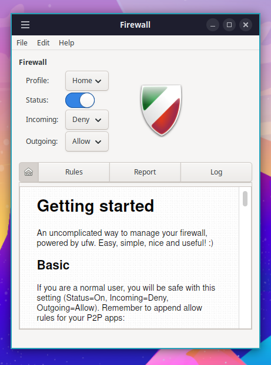

OhMyDebn includes [ufw](https://help.ubuntu.com/community/UFW) and configures it to deny inbound traffic.

You can manage firewall rules from a [terminal](terminal.md) using `sudo ufw`. If you prefer a graphical interface, you can launch [Firewall Configuration](https://help.ubuntu.com/community/Gufw) via the Cinnamon menu or the OhMyDebn menu (Apps > Other Apps, or just type its name).

