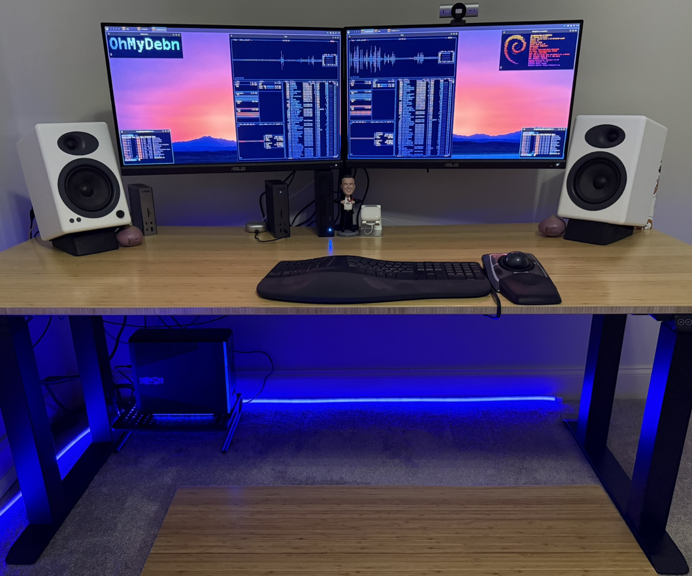
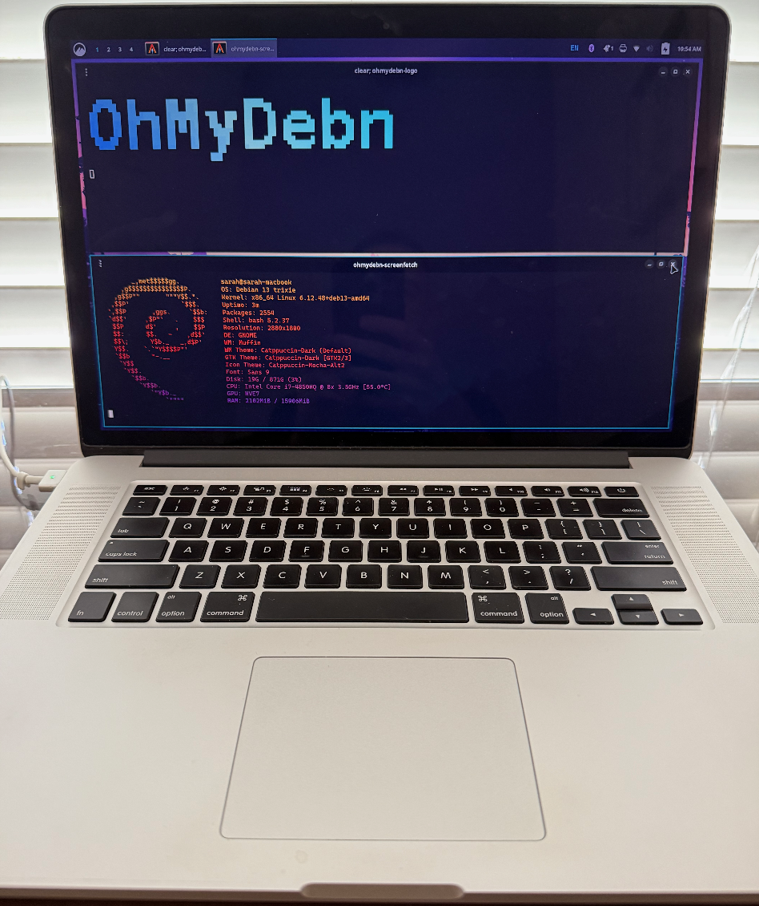
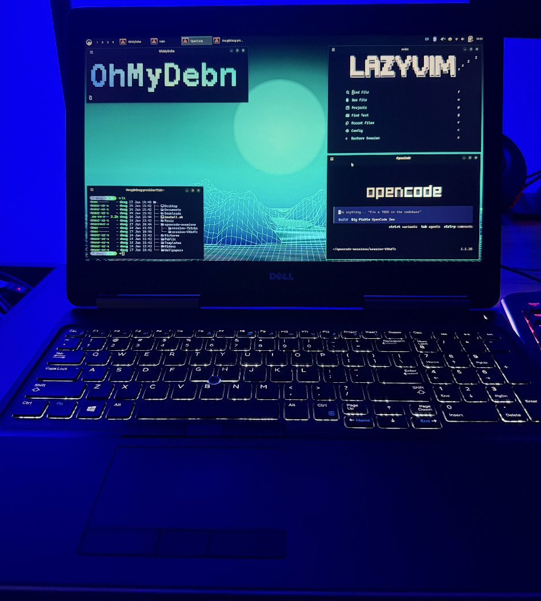
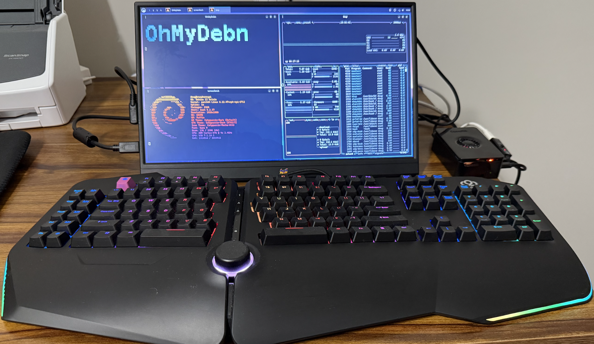

## Battle Station

Here's my OhMyDebn battle station! This is a mini PC running OhMyDebn as the main OS and OhMyDebn as a guest virtual machine.

## 2014 MacBook

Here's an old MacBook from 2014. Apple says it's EOL but OhMyDebn breathes new life into it!

## 2017 Dell Precision

Here's a Dell laptop that Microsoft says won't run Windows 11 but it runs OhMyDebn beautifully!

## Raspberry Pi

You can even run OhMyDebn on a Raspberry Pi!

