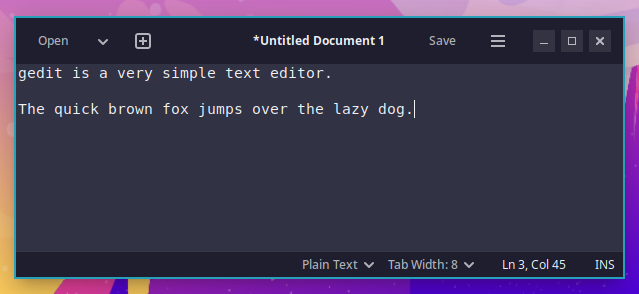
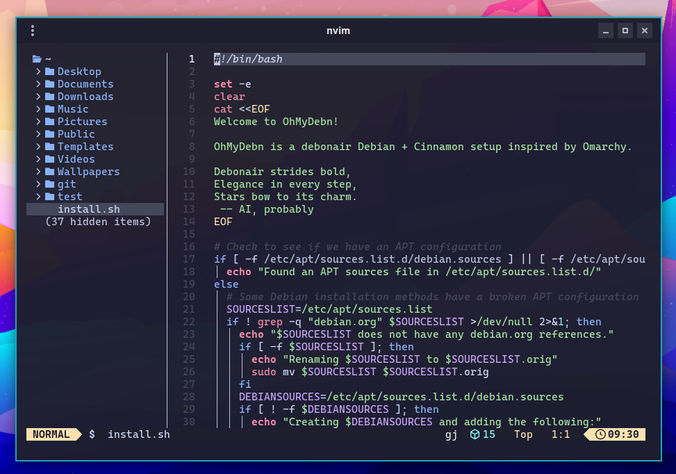
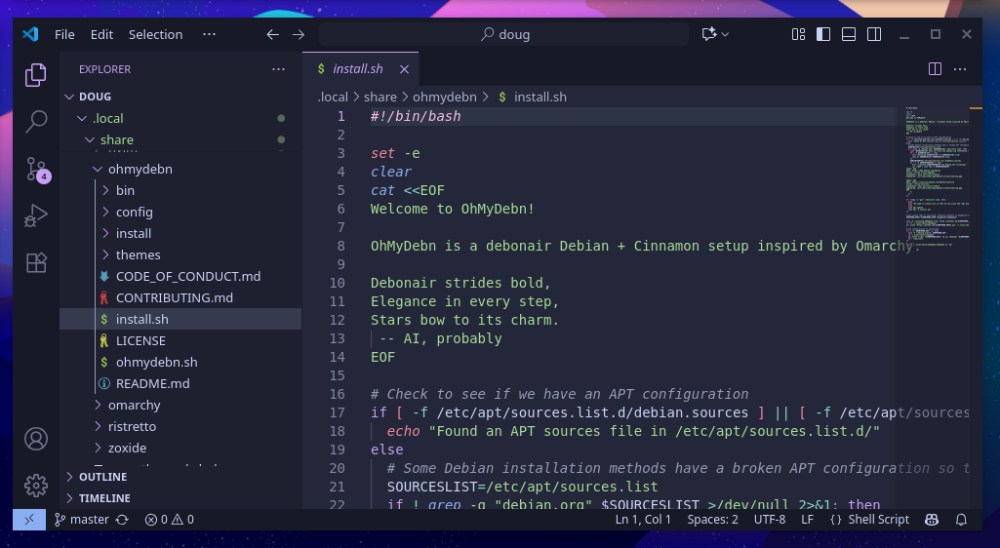

There are multiple options for text editors depending on your needs.

## gedit

gedit is a very simple text editor with a graphical user interface. You can launch it from the OhMyDebn menu (Apps > Other Apps, or just type its name) or by pressing `Ctrl + Super + E`.

## Neovim

Neovim is a powerful terminal-based text editor. To start it, press `Super + N` or type `nvim` at any terminal prompt. It's set up with [LazyVim](https://www.lazyvim.org), and everything it needs (plugins, language tools, and syntax highlighting) is installed with OhMyDebn, so it's ready to use right away, even offline. Press the space bar and then the `E` key to open Explorer. Its colors follow your [desktop theme](desktop-themes.md) and change when you switch themes; a theme that doesn't include its own Neovim colors gets colors made from its palette. OhMyDebn installs the same current version of Neovim on every supported distro.

The [hotkeys](hotkeys.md) section includes more hotkeys for Neovim and a link to additional information.

### Plugin updates

OhMyDebn installs its own current version of Neovim and updates Neovim's plugins with OhMyDebn releases, after testing them together, so a plugin update can't break your editor between releases.

You can still update plugins yourself with `:Lazy update`. The next OhMyDebn release that updates Neovim's plugins puts its own plugins back to the tested versions. Plugins you've added yourself are never changed. Whatever an update replaces is kept in a folder in `~/.local/share/nvim` named `ohmydebn-backup-` followed by the date, until the next plugin update. You can delete it at any time.

To add support for another language, use `:LazyExtras`. The language tools it needs download the first time, so that needs an internet connection.

## Emacs

[Emacs](https://www.gnu.org/software/emacs/) is available as an optional installation. You can install it from the OhMyDebn menu via Apps > Editors > Emacs. That menu option checks to see if it's installed first, so even on a new installation it will install and then run Emacs.

## Visual Studio Code

Visual Studio Code (VS Code) is a powerful text editor with a graphical user interface. You can install it from the OhMyDebn menu via Apps > Editors > VSCode. Once installed, you can launch it from the Apps menu or by pressing `Ctrl + Super + S`.

